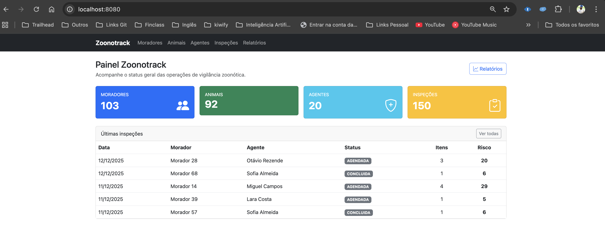
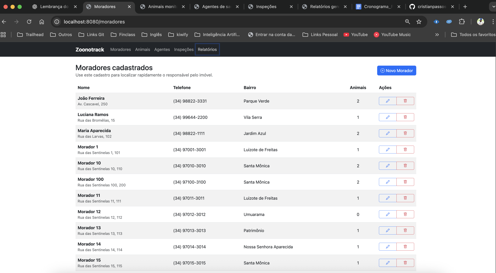
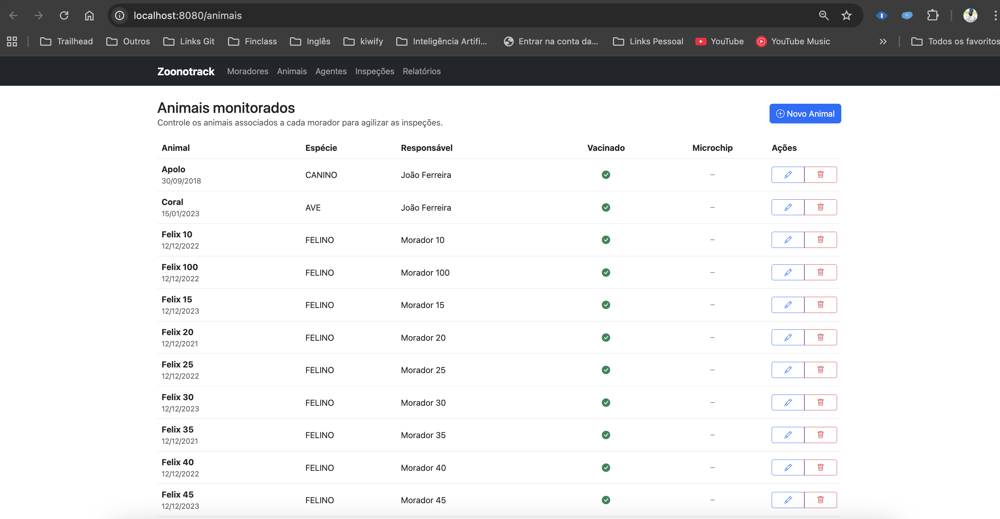
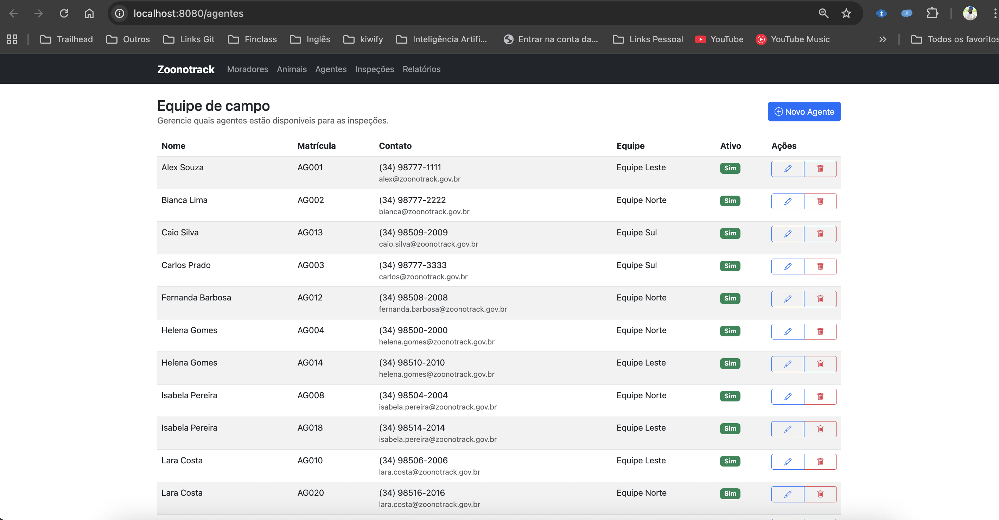
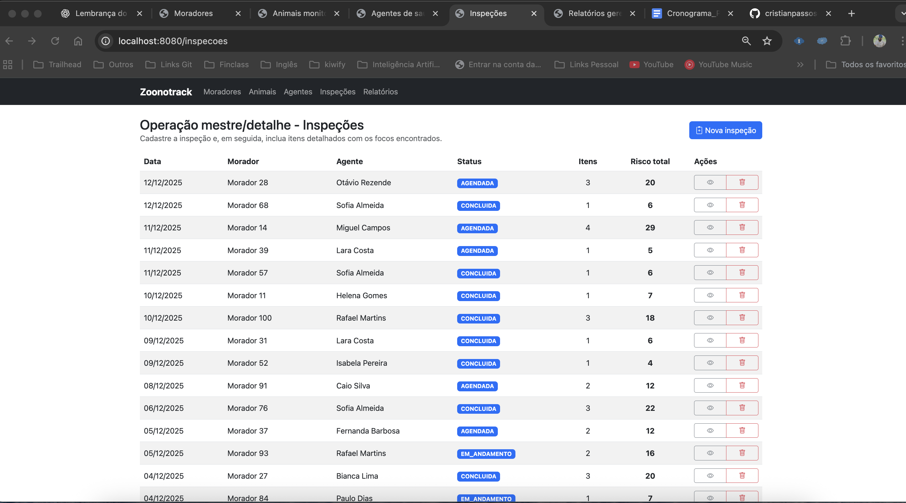
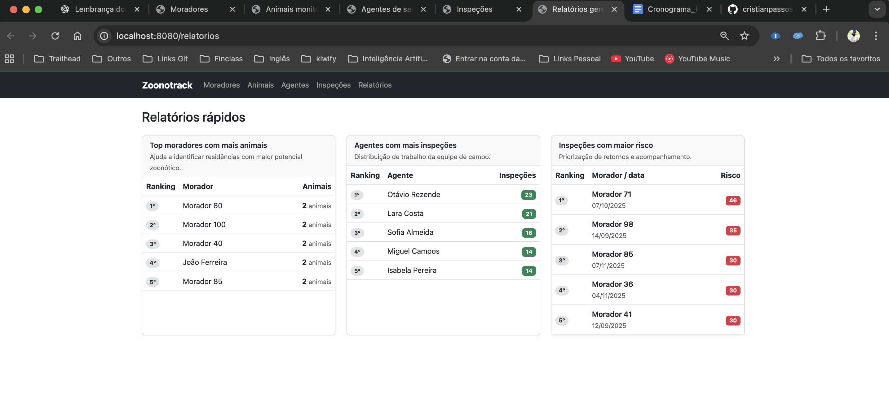

# Zoonotrack

## Introdução

Zoonotrack é um sistema MVC em Spring Boot criado para apoiar equipes de vigilância zoonótica de Uberlândia/MG. A plataforma centraliza o cadastro de moradores, animais monitorados e agentes de saúde, registra inspeções sanitárias (mestre/detalhe) e gera relatórios gerenciais para orientar ações de campo.

## Arquitetura do sistema

- **Stack:** Spring Boot 3 (Web, Thymeleaf, Data JPA), H2 Database, Lombok e Bootstrap 5.
- **Camadas:** Controllers (MVC) → Services (regras de negócio e transações) → Repositories (Spring Data JPA) → Entities (modelo relacional).
- **Banco:** H2 em memória (`jdbc:h2:mem:zoonotrackdb`). O carregador `DataLoader` popula automaticamente moradores, animais, agentes e 150 inspeções de teste.
- **Front-end:** Thymeleaf com layout único (`templates/fragments/layout.html`), Bootstrap/Bootstrap Icons e partials para navegação.

## Modelo de domínio

Principais entidades e relacionamentos:

```
Morador 1 ---- * Animal
Morador 1 ---- * Inspecao * ---- 1 AgenteSaude
Inspecao 1 ---- * InspecaoItem * ---- 0..1 Animal
```

- **Morador:** responsável pelo imóvel, endereço, histórico de risco e vínculos com animais/inspeções.
- **Animal:** atributos sanitários (espécie, vacina, microchip) e vínculo `@ManyToOne` com o morador.
- **AgenteSaude:** equipe, contato e status.
- **Inspecao:** data, status (`StatusInspecao`), morador, agente e observações.
- **InspecaoItem:** faz o detalhamento da inspeção com tipo de foco (`TipoFoco`), recomendações, risco e opcionalmente um animal envolvido.

## CRUDs entregues

1. **Moradores:** `MoradorController`, listagem em tabela responsiva, formulário completo com endereço e histórico, contagem de animais.
2. **Animais:** permite cadastrar animais por morador, indicar espécie, vacinação, castração e microchipagem.
3. **Agentes:** controla matrícula, equipe, contatos e status ativo. Todas as telas usam Bootstrap e feedbacks de sucesso.

## Operação mestre/detalhe (Inspeções)

- Backend (`InspecaoService`/`InspecaoController`) gerencia salvar inspeção, adicionar/remover itens, garantir vínculo com morador/agente e totalizar risco via `getTotalRisco`.
- Itens permitem registrar larvas de dengue, presença de morcegos, carrapatos em cães, etc. Cada item tem recomendação e nível (0-10).
- O `DataLoader` cria 150 inspeções distribuídas entre as equipes, garantindo material para relatórios e testes.

## Relatório

`RelatorioService` monta três visões rápidas consumidas pela página `/relatorios`:

1. **Top moradores com mais animais** – identifica residências com maior potencial zoonótico.
2. **Agentes com mais inspeções** – mostra distribuição de trabalho das equipes.
3. **Inspeções com maior risco** – prioriza retornos conforme totalização dos itens.

Os DTOs (`service/dto`) isolam a projeção de dados exibida na UI.

## Prints das telas

Coloquei as capturas mais recentes em `docs/prints/` (adicione suas imagens reais antes de publicar):

- 
- 
- 
- 
- 
- 
- 
- 
- 
- 

## Instruções de execução

1. **Pré-requisitos:** Java 17+ e Maven.  
2. **Rodar o projeto:**
   ```bash
   ./mvnw spring-boot:run
   ```
3. **Acesso:** http://localhost:8080  
   - Dashboard com cards e últimas inspeções.  
   - Menu superior para CRUDs, inspeções e relatórios.
4. **Banco/H2 Console:** http://localhost:8080/h2-console  
   - Driver: `org.h2.Driver`  
   - JDBC URL: `jdbc:h2:mem:zoonotrackdb`  
   - Usuário: `sa` (sem senha)
5. **Dados iniciais:** carregados automaticamente por `DataLoader` para facilitar testes, relatórios e prints.